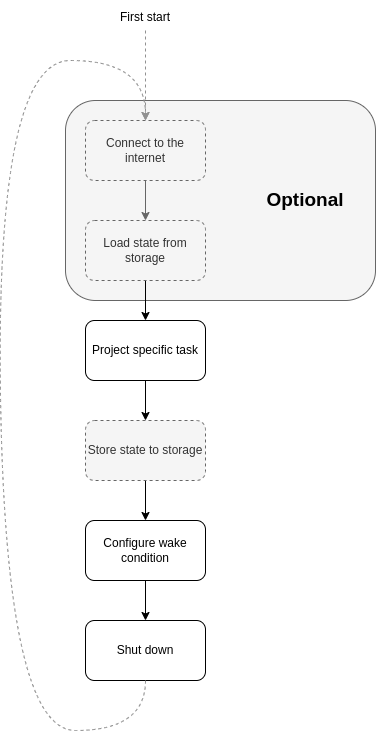

# Enabling deep sleep for your Raspberry Pi project

Single board computers (SBCs) are awesome, small, low-power devices, often with wireless connectivity, which makes them ideal for simple **battery operated projects**.

However, when calculating your energy budget, you often come to realize they are not quite low power enough to accommodate for small batteries, or long-time (multiple days/months) operation. We often don't need full-time availability, so why not **putting our computer to sleep to improve our project battery life**?

In this article, we will discuss a **simple approach to enable deep-sleep capability** on your next battery powered Raspberry Pi (or any SBC-powered) project.

## The study case

During this article, we will use our BalenaLabs [Inkyshot] project, which perfectly fits the intermittent operation, battery operable use case.


To put it in few words, the project at startup will *connect to the internet, pull a new inspirational quote, or your local weather, and then will update the eInk display*, this process is repeated once in a while (generally once every hour), staying idle the rest of the time.

This project is perfect for battery operation because *eInk display retains the display without power*, which allows us to power down the system entirely to save battery.

## Bill of materials

To reproduce this project, you will need:
- A Raspberry Pi compatible SBC,
- A SD card,
- A [Raspberry Pi Pico](https://www.raspberrypi.com/products/raspberry-pi-pico/) micro-controller board,
- A voltage regulator with enable pin (we used _Weewooday-5825_ found on Amazon, but you can also [convert a LM2596S kit](./control_lm2596s_enable.md)),
- A [Inky pHat](https://shop.pimoroni.com/products/inky-phat?variant=12549254217811) or [Waveshare 2.13"](https://www.waveshare.com/2.13inch-e-paper-hat.htm) eInk display module,
- 2 USB-A to Micro-USB cables (or one + one A to C if using a Pi4),
- A power source in the 6-12V range, with at least 1A capability (depending on the Raspberry you chose),
- A way to connect to your power source (alligator clips, barrel jack...),
- A perf board to mount everything together (optional).

You will also need:
- A soldering iron,
- some solder,
- some wires to connect everything.

## Our goal

To keep power consumption as low as possible, the best approach is to:

1. Start our system,
2. <span style="color:gray">_Connect to the internet (optional, depending on the project requirement)_</span>,
3. <span style="color:gray">_Load our project state from storage (optional, depending on the project requirement)_</span>,
4. Do our project processing, updates, communications...,
5. Program our next wake up conditions,
6. Go to deep sleep to preserve as much power as possible,
7. Repeat from [2] on wake-up.



If we apply it to our use-case, we want to:

1. Start our system at power-up,
2. Connect to the internet,
3. Pull our data and update the display,
4. Program a 1h sleep period,
5. Go into deep sleep,
6. Repeat from [1].

### The problem

Doing such an operation cycle is however _not natively supported on RaspberryPies_, as they can't natively go to low power mode. The only way to drastically reduce power consumption is to _shut down the SBC and cut down the power supply_.

Once the system is shut down, you need manual/external intervention to power it back on.

## Proposed solution: Morpheus

To reduce the power consumption, a common approach in embedded systems is to cut the power supply on the main energy hungry components. To do so, we will use an ultra low power external circuit able to keep track of the time, communicate with the Raspberry Pi, and control its input power supply.

Here enters _Morpheus_.

### Presentation

_Morpheus_ (named after the [greek god of sleep and dreams](https://en.wikipedia.org/wiki/Morpheus)), is a Raspberry Pi Pico based project designed to interface between your Raspberry Pi power supply and your Raspberry Pi. 

**HERE a visual of RPi pico in between the wall plug and the Pi3**

### Architecture

The Raspberry Pi Pico (called **Pico** here-after) is a $4 Micro-Controller Unit (MCU) development board, powered by an ultra low power 133MHz Dual Cortex-M0+ processor, with 2MB Flash storage for the program and 264kB of internal RAM and USB communication capabilities. This doesn't seems much compared to the Gigabytes of RAM and storage of the Raspberry Pi 3 (called **Pi** here-after) , and to its multi GHz processors, but this is plenty enough to turn ON and OFF a power supply, keep track of time or read sensors data... and all this for a fraction of the Pi power budget (450mW under full load, down to 6.5mW in sleep mode, compared to the 10+W rating of the Raspberry Pi 4 without sleep capability).

The final wiring will follow this diagram:


As the Pico is capable of USB communication, it will be connected to the Pi via USB cable for communication (<span style='color:#ff00ff;'>Pink</span> wire). However, as the Pi power supply will be cut, it also needs an external power input of its own.

Thanks to the clever design of this tiny board, a _VSYS_ pin is exposed on its headers, and is a 5V power input, diode protected from the _VBUS_ input (the USB bus power input). This means if you power the board using a 5V power supply on _VSYS_, it will keep running even when the Pi is OFF, and it won't send power to it through the USB port. This is done using the <span style='color:red;'>Red</span> wire and the 5V voltage regulator (here a 7805, but a higher efficiency one should be preferred).

We the want to connect one of the GPIO (General Purpose Input/Output) pins of the Pico to the control input of the Pi power supply (with <span style='color:green;'>Green</span> wire). **Note in the diagram we are using a BC547 NPN transistor in-line to invert the signal, as the LM2596S control input is active low.**

We chose GPIO 2 for this purpose, as GPIO 0 and 1 are reserved for the default serial communication bus.

We might want to wake-up the Pi using a button press (or any ON/OFF switching mechanism, like a door sensor or a pressure plate). If this is the cas, you can connect the switch between GPIO 3 (<span style='color:cyan;'>Cyan</span> wire from the Pico) and GND (<span style='color:blue;'>Blue</span> wires).

The output of the controlled Pi power supply (<span style='color:orange;'>Orange</span> wire) is connected to a USB type A connector for convenience, but you also can connect directly to the 5V pin on the Pi header, to a cut Micro-USB wire if preferred.

Note that <span style='color:yellow;'>Yellow</span> wires are the 12V power input for the whole project, and should be connected to a 12V, 1.5A capable power source.


### Usage

#### 1. Setting up the MCU

First things first: we have to program the Pico with the [Morpheus Firmware].

1. Start by downloading the [pre-complied UF2 File](https://github.com/wolvi-lataniere/morpheus-firmware/releases/download/v0.1.0/morpheus-serial-v0.1.0.uf2).

2. Then, connect the Pico to your computer with a USB cable, **while keeping the BOOTSEL button pressed**. A new USB disk drive called `RPI-RP2` should appear.

3. Drag the UF2 file to the disk drive, it should automatically disappear in 3 to 10 seconds.

4. When the disk has disappeared, disconnect the Pico from your computer, it is ready to go.

#### 2. Prepare the hardware

Second step it to build the project is to create the hardware assembly according to the [Architecture] diagram.

**IMPORTANT NOTE: You should set the correct output voltage (5V) using a multimeter BEFORE connecting the supply to the Raspberry Pi.**

#### 3. Adding the block to your project

Then, you can add the `morpheus-serial` block to your project. Add the following code to your `docker-compose.yml` file:

```
morpheus-serial:
    image: bh.cr/g_aurelien_valade/morpheus-serial
    cap_add:
      - NET_ADMIN
      - SYS_ADMIN
      - SYS_RAWIO
    labels:
      io.balena.features.supervisor-api: '1'
      io.balena.features.balena-api: '1'
      io.balena.features.sysfs: '1'
      io.balena.features.kernel-modules: '1'
    privileged: true
    environment:
      - "SERIAL_PORT=/dev/ttyACM0"
    devices:
      - "/dev/ttyACM0:/dev/ttyACM0"
    expose:
      - "5555"
```

You can adjust the `SERIAL_PORT` variable value, and the shared device if needed, but those should work fine with our configuration (not that the `SERIAL_PORT` variable is pointing to the shared device).


#### 3. Using the API

The morpheus block exposes a REST API on its TCP port 5555. The [API documentation](./api.md) exposes available commands.

#### 4. Using the CLI script

To help with the Morpheus API access, you can add the [morpheus.sh](https://raw.githubusercontent.com/wolvi-lataniere/morpheus-serial/main/utils/morpheus.sh) helper script to your project.

Ensure the file will be copied to your application container and will be executable.
In the `inkyshot` project, we do in by adding these lines after the `COPY` block of the `inkyshot/Dockerfile` file:

```
COPY morpheus.sh .

RUN chmod +x morpheus.sh
```

Then, add the `MORPHEUS_ADDR` environment variable to your application container, pointing to the serial block (in `docker-compose.yml`):
```
environment:
      - "MORPHEUS_ADDR=morpheus-serial"
```

Finally, call the `morpheus.sh` script when your application is ready to sleep, ask the supervisor to halt the device and start a wait loop.

For `inkyshot` we replaced the `cron` part of the `inkyshot/start.sh` script by the following code:

```
# Request sleep for 1h
./morpheus.sh -a ${MORPHEUS_ADDR} -w TimeSleep 1800

# Clean turn-off
curl -X POST --header "Content-Type:application/json" \
    "$BALENA_SUPERVISOR_ADDRESS/v1/shutdown?apikey=$BALENA_SUPERVISOR_API_KEY"

# Prevent from quitting
while :
do
  sleep 1h
done
```

## Results

In order to qualify the consumption improvement on this system, we did some measurements on a standard _Inkyshot_ project[^Inkyshot], and on an _Morpheus_ modified one [^Modified inkyshot].

### Measurement method

In order to measure the power consumption, we hooked a 0.47Ohms resistor in series with the 12V power supply, we then measured the drop voltage across that resistor during operation.
The tested hardware is:
- A Raspberry Pi Pico running [Morpheus Firmware] v0.1.0,
- A Raspberry Pi 3 B+ running the project,
- A Waveshare 2.13" EInk display Pi Hat,
- A controlled and un-controlled (for the Pico) 5V power supply composed of 2 independent _Weewooday-5825_ modules.

### Standard Inkyshot project

After a high-intensity start-up phase, the consumption settles around 150mA on the 12V line with regular short 250mA spiker, which represents an average consumption of a bit less than **2W**. This value is not affected much with refresh rate.

### Modified Inkyshot project

The main difference with this project is that we have two main consumption profile.

The total boot-up to shutdown time on the Pi is about 150 seconds, with a main consumption phase of 105 seconds averaging 168mV, so about 360mA under 12V which is about **4.3W**, the other 45 seconds, the power is ramping up and down and can be averaged to half that power.

Which makes an activation energy budget of

4.3W * 105s + 2.15W * 45s = 548J = **15.23Wh**

This cycle is repeated every 30 minutes, with a power consumption during the sleep phase of 14mA under 12V, which equals **0.17W**, with a total power over 30minutes of **0.085Wh**.

The total average consumption of this version is about **0.438W** for our 30min sleep cycle.

If we expand the sleep cycles to one hour instead of 30 min however, we get an average consumption of **0.309W**, the refresh rate having a huge impact on power consumption.

### Equivalent battery life

The battery life will vastly depend on the a large amount of factors, starting with:
- the battery type, voltage and capacity,
- the controlled power supplies efficiency and sleep leakage current,
- the time your project needs to be active to process its data,
- the frequency at which you wake up your project,
- the power consumption of external components/add-on cards you are using...

For our use case, with a 30min sleep period, and with the selected components we have, we can approximate:

| Battery                 | Without Morpheus  |  With Morpheus (30min) | With Morpheus (60min) |
|-------------------------|-------------------|------------------------|-----------------------|
| 12V 7.2Ah lead battery  |       43h         |     ~197h = ~8days     |   ~279h = ~11.6 days  |
| 2xCR18650: 7.2V 3Ah     |       10h         |      49h               |         ~70h          | 


**Note:** These values are broad approximations based on nominal values, not taking into account efficiency variation with voltage, nor voltage variation during the battery life cycle.

## Discussion

We saw that adding a deep sleep capability to your project is a major improvement for battery operation, giving in our use-case scenario a x5 to x7 improvement in battery life. In order to be effective, you still have to finely tune your project life-cycle, as we see the refresh rate has a major impact on the battery life when sleeping.

To integrate Morpheus to your project, you still have too keep in mind the following considerations:
- The system state is lost on every power down, you should load/save the state on disk (or other method),
- You may want to keep the system running while updates are pending (this is done with the `-w` flag on the helper script).


### Improvements

Morpheus is still in active development, and we already see a some improvement to consider down the road: 
- Putting the Pico in deep sleep to preserve even more power,
- Shutting down Pico USB while the Pi is not powered, which should also improve power consumption,
- Adding other sources of wake up (I2C sensor threshold value...),
- Using other low power MCU to do the deep sleep with other capabilities (Pico W, ESP32C3...).

If you come with other ideas, you can raise an issue on the project [Morpheus Github Page].

## Resources

You can find here the links to all relevant used projects:
- [Inkyshot]: [The original Inkyshot project](https://github.com/balenalabs/inkyshot)
- [^Modified inkyshot]: [Morpheus modified Inkyshot](https://github.com/wolvi-lataniere/inkyshot-morpheus)
- [Morpheus Firmware]: [Morpheus RaspberryPi Pico Firmware](https://github.com/wolvi-lataniere/morpheus-firmware)
- [Ready-to-use Morpheus-serial block](https://hub.balena.io/organizations/g_aurelien_valade/blocks/morpheus-serial)
- [Morpheus Github Page]: [Morpheus Balena Block source code](https://github.com/wolvi-lataniere/morpheus-serial)