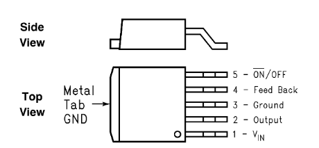

# Converting LM2596S/XL4005E to create a controllable power regulator

In this article, I will present a simple hack you can apply to your cheap DC/DC buck converter to be able to electrically turn it ON and OFF.

## Context

[Power converter](https://en.wikipedia.org/wiki/Electric_power_conversion) are useful pieces of hardware allowing to transform an input voltage to a different (often regulated, fixed independently from the input) output voltage. The most interesting, and most efficient one (but also more complex) are the [Switched-mode power supplies](https://en.wikipedia.org/wiki/Switched-mode_power_supply), converting an input DC voltage to an output DC voltage, with reasonably high efficiency (70~95% depending on the architecture, the components quality and the used output power).

The modules we are interested in are the LM2586S and XL4005E based modules, which are very commonly used in the hobbyists community.


These modules take an input voltage from 0 to 37V and converts it to a **lower**, regulated value, with reasonable current capability (up to 3 to 5 Amps). _Please note that the output voltage of there regulators will drop if the input voltages goes below the requested output value_. These characteristics are perfect to power a _Single Board Computer (SBC)_ (often requiring 5V input voltage) from some battery.

In some project however, we need to be able to remotely enable/disable the SBC power supply, which the modules doesn't allow to do natively (they are always ON, as soon as the input voltage is present). A good example of such a project is the [balenaLabs Morpheus project](https://github.com/wolvi-lataniere/morpheus-serial).

## The hardware you need

To do this project, you will need some supplies:
- A cheap [XL4005E module](https://www.amazon.fr/gp/product/B07VQ89RZG) or [LM2596S module](https://www.amazon.fr/dp/B09L5GBL91),
- If you have a LM2596S module, you will also need a NPN transistor (_e.g. BC547_) and some resistors (in the range 1-10k should be OK),
- A piece of small gage wire (I use [Wrapping Wire](https://www.amazon.fr/BlueXP-Isolants-Électronique-Dordinateur-Multicolor/dp/B07D3PWRVB) for these kind of precision builds).

You will also need some tools:
- A soldering iron (with a fine tip preferably),
- Some solder,
- A small needle, or pliers of some sort,
- (A good lighting will also help).

## The concept

I chose the _LM2596S_ and _XL4005E_ modules for this build for 3 main reasons:
- They are really affordable,
- They are readily available,
- **They use components with a control input**.

The modules both use chips with ON/OFF capability, they just are hard-wired in the module to be always ON. The trick will only consist of de-soldering the relevant pin to expose it and tap into this capability.

## Identifying the chip and the pin

First things first. Start by taking your module and checking the chip marking (I recommend using a good light source, or direct sun-light to make it easier).


We are mostly interested by the second line of markings. For instance, on the photo above, the reference we are looking for is _XL4005E1_, which informs us on the _XL4005E_ chip type.

From there, we get more specific.

### XL4005E conversion

The easiest to convert for our purpose is the _XL4005E_ based modules. Looking in the [component datasheet](https://pdf1.alldatasheet.com/datasheet-pdf/view/763182/ETC2/XL4005E1.html), we see the following pinout:


The pin we are looking for it the _EN_ pin (pin 4). The datasheet states on page 2: 
```
Enable Pin. Drive EN pin high to turn on the device, drive it low to turn it off."_ which is exactly what we are willing to do!
```

From where, the process is quite simple:
- Take your soldering iron and heat-up pin 4 (you can add some solder of flux to help melting the current solder),
- Lift pin 4 with a small tool (I use an precision hobby knife),

- Solder the control wire to the lifted pin,

- I recommend you add some kind of insulation (electric tape, heat-shrink tube...) to prevent the wire or the lifted pin to touch anything else.

**NOTE**: the _XL4005E_ chip seems to have internal pull-up resistor which makes the regulator active when not connected. It is however recommended to connect it either to a high (>1.4V) or low (<0.8V) signal for reliable usage.

At this point, your controllable supply is ready to use in your project.

**IMPORTANT: YOU MUST SET THE TRIMMER TO HAVE THE DESIRED OUTPUT VOLTAGE BEFORE CONNECTING TO YOUR PROJECT!**

### LM2596S conversion

_LM2596S_ module conversion procedure is similar to the _XL4005E_ one, with some caveats. According to the [chip datasheet](https://www.ti.com/lit/ds/symlink/lm2596.pdf), the pin we are interested in is pin 5.



The datasheet page 4 describes it as: 
```
Allows the switching regulator circuit to be shut down using logic signals thus dropping the
total input supply current to approximately 80 μA. Pulling this pin below a threshold voltage
of approximately 1.3 V turns the regulator on, and pulling this pin above 1.3 V (up to a maximum
of 25 V) shuts the regulator down. If this shutdown feature is not required, the ON/OFF pin can
be wired to the ground pin or it can be left open. In either case, the regulator will be in the
ON condition.
```

Which means we have to pull the pin LOW to turn ON the chip, and high to turn it OFF.

You can choose to directly drive it that way (which might require changing your project control logic to match the inverse logic), or use some transistor and resistors to invert the logic (and driving the transistor high will enable the driver).

Ether way, you should start by:
- De-soldering pin 5 by heating it up with your soldering iron and lifting it with a small tool,

- Solder a control wire to the lifted pin,
- I recommend you add some kind of insulation (electric tape, heat-shrink tube...) to prevent the wire or the lifted pin to touch anything else.


**TODO: Write an article to describe how to convert a LM2596S module from amazon to be controlled by a MCU**
